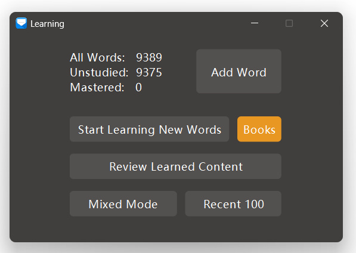
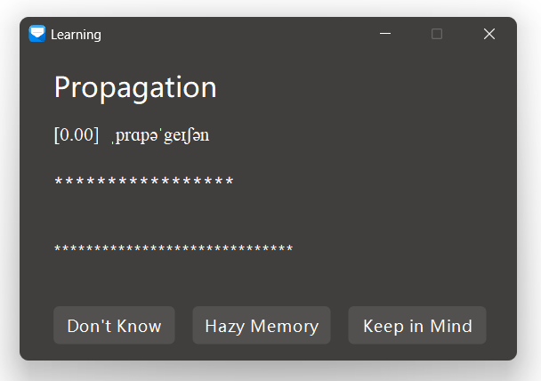
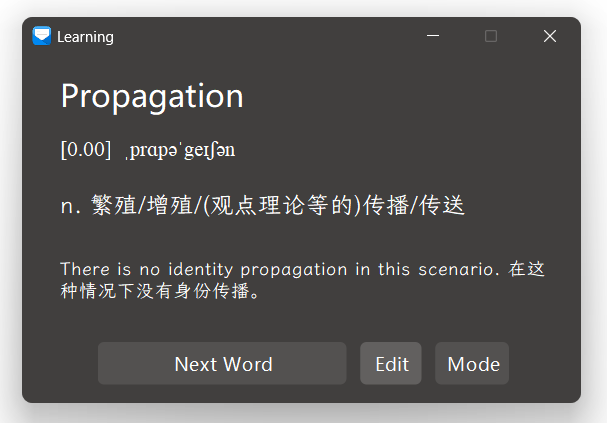
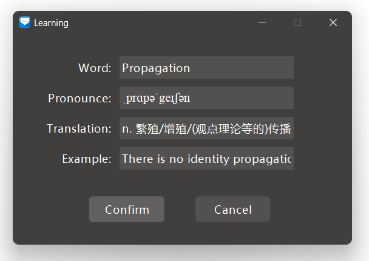

# Windows下简洁高效的背单词应用

Ensk Learning Vocabulary，基于JDK11、Sqlite开发的（理论上JDK1.8也能运行，但是不支持DPI缩放，打包的运行程序已经内置了JDK11）。

程序运行前，请首先安装 `doc\font` 文件夹里面的 `霞鹜文楷_1.300.zip` ，以获得最佳的显示效果。

直接点击RUN.bat即可运行。

主界面如下如所示：

左上是当前所选的Book（db文件）的学习概要，全部词汇、未学习的词汇和已经精通的词汇数量。

点击 `Add Word` 可以手动往当前Book添加词汇。

点击 `Start Learn New Words` 便开始学习全新的单词，该模式会从未学习的词汇中随机选一个显示出来，隐藏翻译和例句，如下如所示：

如果您完全不认识这个词，点击 `Don't Know`，然后会显示翻译和例句，如下图所示：

然后会记录当前词汇 `学习次数` `+1`  `Don't Know 次数` `+1`。如果对这个单词有点影响，但又不确定，可以点击 `Hazy Memory`，也会显示翻译和例句，同时 `学习次数` `+1`  `Hazy Memory 次数` `+1`。同理点击 `Keep In Mind`，在显示翻译和例句后，`学习次数` `+1`  `Keep In Mind 次数` `+1`。

每次点击如上的三个按钮，都会计算当前单词的学习分数，计算规则如下：( `Don't Know 次数` X `0.1` + `Hazy Memory 次数` X `0.5`  + `Keep In Mind` X `1.0`  ) / `学习次数`，单词分数最高为1.0分，同时显示在单词发音的前面，如：`[0.87]`

点击 `Next Word` 按钮，会继续学习下一个随机单词。

如果当前单词显示信息不正确，或者想自己重新编辑例句，可以点击 `Editd` 按钮，先显示编辑界面，如下图所示：

以上说的学习模式是 `Start Learn New Words`，还有另外两个模式： `Review Learned Content`，会随机学习已经学习过的，分数在0.1~0.7的单词。 `Mixed Mode`，会随机学习全部单词。

程序默认的库是雅思词库，如果想选择其他词库，如CET4，可以把从 `doc\db` 目录下复制对应的db文件到当前运行目录，并备份当前目录的现在学习的db文件，重新运行程序即可。程序运行时会首先检查当前运行目录是否存在.db结尾的Sqlite数据库文件，存在的话会直接连接这个数据库文件（存在多个会默认连接第一个）。
